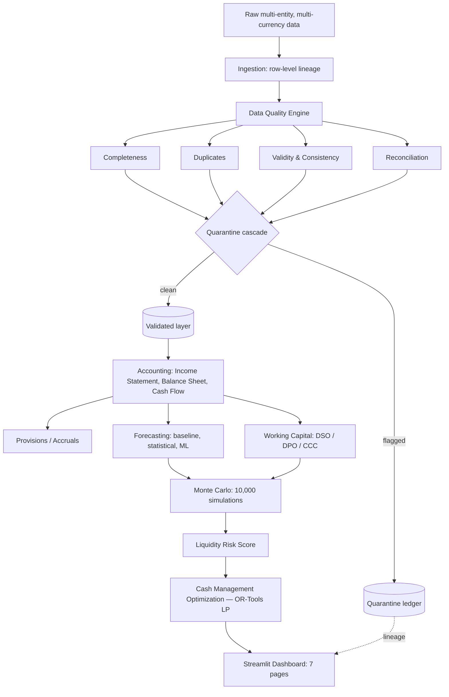
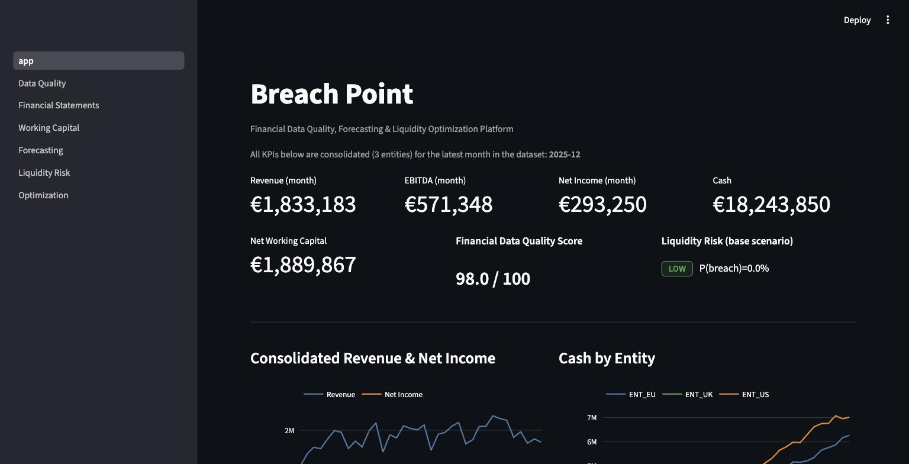
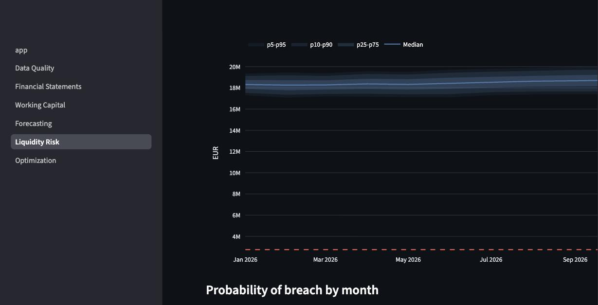
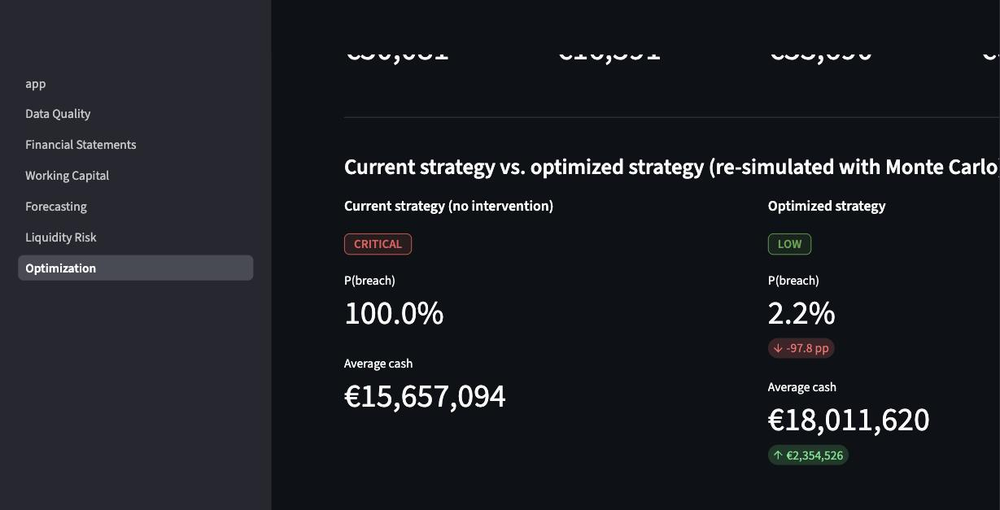

# Breach Point

**Financial Analytics Platform**

An end-to-end financial analytics and decision-intelligence platform: it validates
messy, multi-entity financial data, builds reconciled financial statements, forecasts
revenue, expenses and cash flow, quantifies liquidity risk with Monte Carlo
simulation, and optimizes cash-management decisions to keep the company above its
minimum liquidity requirement — all on a synthetic but internally consistent
three-entity, three-currency company, generated and audited end to end by the
pipeline itself.

Every number in this README comes from an actual run of the pipeline on 2026-09-14
(`make all`, seed=42). Nothing here is fabricated or hand-typed to look good — where
a result was underwhelming (e.g. a company too well-capitalized to show any real
liquidity risk) or a bug produced a wrong number, that's said explicitly below and in
`CLAUDE.md`, not smoothed over.

## Why this exists

A finance/FP&A team receiving data from five different operational systems (ERP,
banking, invoicing, payroll, AR/AP) doesn't get to assume it's clean. Before revenue
gets forecast or a liquidity decision gets made, someone has to answer: *can we trust
this data, and by how much?* This project builds that whole chain — validate, then
report, then forecast, then quantify risk, then decide — as working software, not a
slide deck.

## Architecture



Raw data never gets edited or silently dropped — every record that fails validation
moves to quarantine with a full lineage trail (`record_id`, `validation_rule`,
`severity`, `reason`, `timestamp`), and the validated layer downstream is exactly
`raw − quarantined`, verified in tests to lose or duplicate nothing.

## Results

| | |
|---|---|
| Financial Data Quality Score | **97.97 / 100** (Completeness 97.6, Uniqueness 98.9, Validity 98.3, Consistency 99.6, Reconciliation 95.4) |
| Records quarantined | **15,458** of 188,939 raw records across transactions/AR/AP (CRITICAL/HIGH severity only) |
| Balance Sheet reconciliation | **108/108** entity-months PASS (Assets = Liabilities + Equity, by double-entry construction) |
| Cash Flow reconciliation | **108/108** entity-months PASS (independently computed, tied to the Balance Sheet's own cash) |
| Consolidated revenue (36mo) | **€69.2M** — Net income: **€8.75M** (ENT_EU €2.37M, ENT_UK €2.55M, ENT_US €3.84M) |
| Working capital | DSO 56–108 days · DPO 56–132 days · CCC mostly positive (12–165 days), ENT_EU briefly dips to -4 |
| Forecast model selection (18 series) | naive 7 · gradient boosting 4 · exponential smoothing 4 · seasonal naive 3 — no single family dominates |
| Liquidity risk (base/optimistic/pessimistic) | **LOW** in all three — worst simulated consolidated cash never drops below €13.3M against a €2.75M policy |
| Optimization (stress-test demo) | Liquidity risk **CRITICAL (100% breach) → LOW (2.2%)** for ~€50,081 total cost |

The full per-phase breakdown — methodology, exact figures, and every bug found and
fixed while building each stage — lives in `CLAUDE.md`; the highlights are below.

## How it works

### 1. Synthetic data (`src/data/`)

Three legal entities (`ENT_EU`/EUR, `ENT_US`/USD, `ENT_UK`/GBP), 107 GL accounts, 45
vendors, 180 customers, 36 months (2023–2025). Revenue and expenses are generated
first as monthly targets (trend, seasonality, business-unit mix, a deliberate
late-window slowdown, and empirical noise); a real double-entry ledger is then built
to match those targets, so financial statements built from the ledger stay
consistent with the series forecasting is trained on. **147k+ transaction lines**,
reproducible bit-for-bit under seed=42 (verified in CI and in a from-scratch clean
clone, see *Verification* below).

Realistic data problems are injected on top of the clean ledger: duplicates (~0.8%),
missing values (rate varies by field — 5% on optional metadata, 1% on account IDs,
0.05% on amount), invalid currencies/accounts/negative amounts, misclassified
accounts, unbalanced journal entries, a dropped entity-month of AP data, and
malformed dates.

### 2. Data Quality Engine (`src/quality/`)

Schema, completeness (severity varies by field and business context — a missing
`payment_date` is LOW severity on an unpaid invoice, HIGH if the invoice is marked
paid), duplicates (exact, business-key, and a same-day/0.5%-tolerance near-duplicate
heuristic), validity, referential integrity, and journal-entry reconciliation.
**Quarantine cascades to the whole document** when any one leg is flagged — a
document with one bad leg costs the whole document, not just that leg — which is
exactly why the validated `transactions.csv` has zero unbalanced documents.

### 3. Financial Statements (`src/accounting/`)

Monthly Income Statement, Balance Sheet and Cash Flow per entity, in EUR (converted
via `fx_rates.csv`). Corporate income tax is estimated at statement-build time (not
journaled) as a flat statutory rate on pre-tax income, with an explicit
`income_tax_payable` accrual so the notional deduction doesn't break the accounting
equation. Cash Flow is computed *independently* from document type and only then
compared to the Balance Sheet's own cash — a genuine reconciliation check, not a
tautology.

### 4. Provisions & Working Capital (`src/provisions/`, `src/accounting/working_capital.py`)

`Accrual = ExpectedExpense (rolling 3-month average) − RecognizedExpense`, with a
95% confidence interval from the estimate's own standard error, for Utilities,
Professional Services, Logistics and Interest Expense — 1,615 estimates, verified
unbiased (mean accrual stays under 15% of mean recognized cost in every category).

DSO/DIO/CCC use the textbook formula; **DPO deliberately uses
`AP / (COGS + Operating Expense)`, not the textbook `AP / COGS`** — this company's AP
funds a broad vendor base (rent, software, marketing, logistics — not just inventory
purchases), and a COGS-only denominator inflated DPO to 150–250+ days.

### 5. Forecasting (`src/forecasting/`)

Naive/seasonal-naive baselines, Holt-Winters Exponential Smoothing, and scikit-learn
`GradientBoostingRegressor` (recursive multi-step) — all evaluated on a genuine
6-month **blind holdout** (train prefix only; corrupting the held-out values doesn't
change the forecast, verified in tests) and the lowest-RMSE model selected per
series, refit on full history for the real 12-month forecast. **Naive wins for
Revenue on all three entities** — a real finding: the holdout window sits inside
Phase 2's deliberate slowdown, where trend-following models overshoot and "no
change" happens to do less damage.

### 6. Monte Carlo & Liquidity Risk (`src/simulation/`, `src/risk/`)

10,000 simulations × 12 months × 3 entities. Every stochastic input is calibrated
from real data, not invented: Revenue/OpEx noise from each series' own forecast
residual std; customer/supplier payment-timing risk from simulated DSO/DPO drawn
from their historical distributions (so slower-paying customers show up as an actual
cash effect via simulated AR, not a generic volatility knob); COGS from simulated
Revenue × historical margin. Base/Optimistic/Pessimistic scenarios shift the
simulation's center before Monte Carlo explores uncertainty around it.

**Liquidity risk comes out LOW in all three scenarios.** The minimum-cash policy was
recalibrated from the spec's illustrative €1,000,000 example to **€2,750,000**
(~2 months of this company's actual ~€1.37M/month operating outflow) — the literal
example is under a month of spend for a company holding ~€18M cash, which would make
every score trivially LOW regardless of scenario. Even after recalibrating, and even
pushing the pessimistic assumptions much further in ad-hoc testing (down to -95%
revenue), the *consolidated* (cash-pooled across 3 entities) position never breached
— a genuine cash-pooling diversification benefit, not a tuning failure.

### 7. Optimization (`src/optimization/`)

A continuous LP (OR-Tools GLOP) chooses the lowest-cost mix of short-term borrowing,
receivables factoring, payment deferral and CAPEX reduction that keeps consolidated
cash above a minimum every month. Because the real policy is never threatened, the
demonstration uses an explicitly-labeled **hypothetical stricter policy (€16M)**
under a stress scenario, purely to exercise the decision mechanism — reported
side-by-side with `real_policy_headroom` (always positive) so it's never confused
with the actual liquidity policy.

A deterministic LP optimized against the point forecast alone barely helped once
re-evaluated against actual Monte Carlo variance (100% → 97.5% breach probability).
Adding a volatility-based safety buffer (a standard chance-constrained-LP
approximation, sized to 3 standard deviations of the Monte Carlo's own month-by-month
spread after 1σ and 2σ were tested and found under-protective) took it to:

**Liquidity Risk: CRITICAL (100% breach probability) → LOW (2.2%)**, for a total cost
of ~€50,081 (financing €16,391 + factoring €33,690; CAPEX deferral went unused —
cheaper levers covered the shortfall first).

## Dashboard

7 pages, reading `reports/outputs/` and `data/processed/` (what `make all` already
produced) rather than recomputing the pipeline per click.

<p align="center">
  
  
  
</p>

Executive Overview · Data Quality (filterable quarantine table, joined back to
entity/source/account) · Financial Statements · Working Capital · Forecasting ·
Liquidity Risk (Monte Carlo fan chart shown above) · Optimization (before/after
comparison shown above, CRITICAL → LOW).

## Verification

Before calling this done, the full pipeline was run in a **from-scratch clean
clone** (`git clone` into a fresh directory, new venv, `make install && make all`) —
not just the working dev environment — which happened to also pull newer major
dependency versions than development used (pandas 3.0.5 / numpy 2.5.3 vs. the 2.x
line used during development). Every stage produced byte-identical results to the
documented figures above, and **115/115 tests passed** with **95% line coverage of
`src/`**. See `CLAUDE.md` for the full list of real bugs found and fixed during
development (an asymmetric-quarantine balance-sheet bug, an AR write-off gap that let
receivables grow unboundedly, a DPO formula mismatch, a Monte-Carlo-vs-LP calibration
gap, and others) — left visible on purpose, since finding and fixing them honestly is
the actual engineering content of this project.

## Tech stack

Python 3.11+ · pandas, numpy, scipy · scikit-learn, statsmodels · Plotly, Streamlit ·
pydantic, pandera · OR-Tools · pytest, pytest-cov

## Installation

```bash
git clone https://github.com/AlvaroVerona/breach-point.git
cd breach-point
python3 -m venv .venv && source .venv/bin/activate
make install
make all          # full pipeline: data -> quality -> statements -> ... -> tests
make dashboard     # streamlit run app/app.py
```

Individual stages: `make generate-data`, `make validate`, `make build-statements`,
`make provisions`, `make working-capital`, `make train`, `make simulate`,
`make risk`, `make optimize`, `make test`.

## Project structure

```text
breach-point/
├── src/
│   ├── data/            # generation, ingestion, quality injection
│   ├── quality/          # schema, completeness, duplicates, validity, consistency, reconciliation
│   ├── accounting/        # income statement, balance sheet, cash flow, working capital
│   ├── provisions/        # accrual estimation
│   ├── forecasting/       # baseline, statistical, ML models + evaluation
│   ├── simulation/        # Monte Carlo
│   ├── risk/               # liquidity risk scoring
│   ├── optimization/       # OR-Tools cash management LP
│   └── common/              # config loader, logging
├── app/                    # Streamlit dashboard (7 pages)
├── config/settings.yaml     # every constant/threshold/seed, nothing hardcoded in code
├── tests/                   # 115 tests, 95% coverage
├── reports/outputs/          # pipeline artifacts (CSV/JSON), gitignored
├── data/{raw,processed,quarantine}/  # RAW -> VALIDATED -> QUARANTINED, gitignored
└── CLAUDE.md                  # detailed engineering log: every decision and bug, with why
```

## Limitations

- **Synthetic data.** Realistic in structure and internally consistent, but not real
  financial data — patterns (seasonality, payment behavior, the deliberate slowdown)
  are simulated, not observed.
- **Simplified accounting.** No multi-currency FX gain/loss postings, no full
  perpetual-inventory costing beyond the simplified purchase/consumption model, no
  intercompany eliminations.
- **Simplified financing.** Historical debt balance is flat (no amortization/new
  issuance) — new borrowing exists only as a forward-looking optimization lever.
- **Forecast uncertainty is real, not hidden.** MAPE is unstable on any series that
  crosses near zero (documented, not patched over); confidence intervals come from a
  6-month holdout on only 36 months of history, which is a small sample.
- **Optimization is a static, pre-committed plan** applied uniformly to every
  simulated path, not a reactive policy that adjusts to realized cash — a genuinely
  harder (stochastic dynamic programming) problem, out of scope here.
- **The company is well-capitalized by construction**, so the liquidity-risk story
  needed an explicitly-labeled hypothetical stress policy to have something for the
  optimizer to solve — a limitation of the specific synthetic company generated, not
  of the methodology.

## Future improvements

Real ERP/banking integration, automated Excel/API ingestion, a proper database
backend instead of CSVs, real-time data quality monitoring, full data lineage
tooling, Airflow orchestration, MLflow model tracking and monitoring, cloud
deployment, a reactive (not static) optimization policy.

---

*Built as a portfolio project demonstrating end-to-end financial analytics
engineering: from raw, imperfect multi-entity data to a validated, forecasted,
risk-quantified, and optimized decision-support system.*
